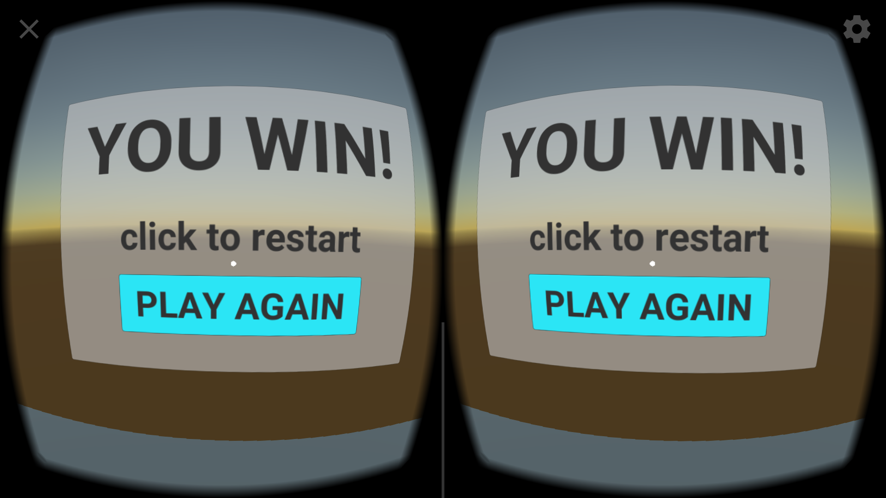

# Puzzler Project

## Introduction

Puzzler is a proof of concept game for mobile-phone based head mounted displays. It takes a user into a single room where they have to repeat a pattern correctly in order to exit. If they like, they can play the puzzle more than once. In future versions, this experience can be extended by building additional rooms with additional puzzles. 

[Here's a video walkthrough](Documentation/puzzler_demo.mp4)

## Outcomes

- enter and repeat menus
- interactive sound and visuals
- smooth navigation through spaces
- single room puzzle

## Target Persona and Goals

**Name**: Joe

**Age**: 27

**Occupation**: Accountant

**Picture**: ¯\\_(ツ)_/

**Quote**: "I finally solved it!"

**Description**: Joe is a person who likes to play games on his phone to relax. He doesn't have the highest end phone, but he's willing to spend a few dollars.

**Experience**: He's tried a few VR experiences but mostly enjoys puzzle solving more than movement games

### Goals
- attract people who like to play puzzle games
- attract people who own headsets
- attract people who like dungeon crawlers

## Story of the process

This project started with a simple idea for a single-room puzzle application. After setting up the basic room layout I sketched out some menus for the welcome and success/retry menus. This is detailed further in the user feedback section.

As it became clearer that the mechanic of the game would be to point to the orbs in a sequence, it no longer made sense to have them scattered around the room. In response to user feedback I moved the orbs to the center of the room so users only needed to move their head a little to change selection between orbs.

Barrels stashed in the corner made the scene more interesting.

The gate beckons users to the horizon.

Once the orbs were configured in an accessible way, the interactions made a lot more sense when I paired audio and visual signals to indicate the pattern. The negative sound provides a strong incentive to avoid making mistakes.

I moved the end state canvas to behind the exit door and connected it to the master game logic script. Now it's not only clear when you've succeeded but you can also play again.

## User testing outcomes and iteration

This project ran testing in three phases:

### Initial Concept

Users like the idea of a puzzle game and found the experience of google cardboard interesting. They recognized the dark dungeon type mood and found the scale to be pretty normal though one noted a sensation of floating, probably due to tracking only rotation (and not movement). The orbs attracted the attention they were supposed to.

### Menu Interaction

The menu interaction was pretty straightforward. No one had any issues understanding what pressing the buttons would do. Based on the sketches, more people preferred the play / play-again version (sketch 3) to the others.  

During the initial test, the mechanics of switching between menus worked well but the menus were too far away and the fonts did not look right.

These menus evolved over several stages before reaching the final version.

### Puzzle Interaction

People enjoyed the orb puzzle but had mixed views of whether more instructions should be provided or not. Some liked having to figure it out based on the light and sound cues. Others wanted more instructions.

## Conclusion

Puzzler provides a fun and interesting way to play games in a head mounted display. It's easy to learn and engaging to take part in. Future versions could provide additional rooms with more puzzles and scaling difficulty levels.

----

## Development Version Notes
- Unity 2017.1 / 2017.3.0
- ~GVR Unity SDK v1.60.0~ GVR Unity SDK v1.11 (upgrade to ResonanceAudio)
- iTween v2.0.7
